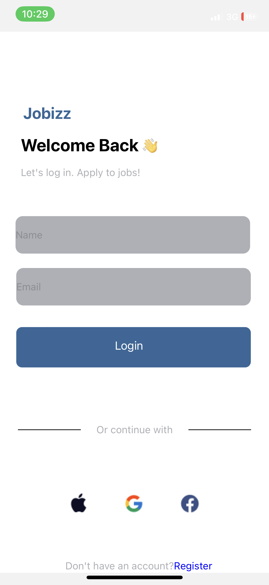
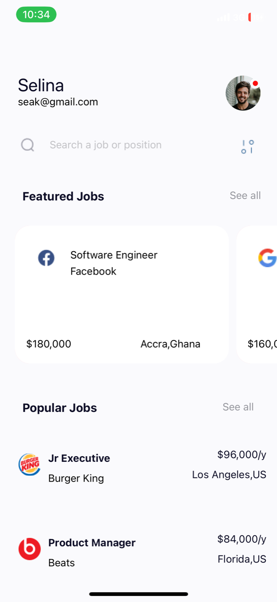
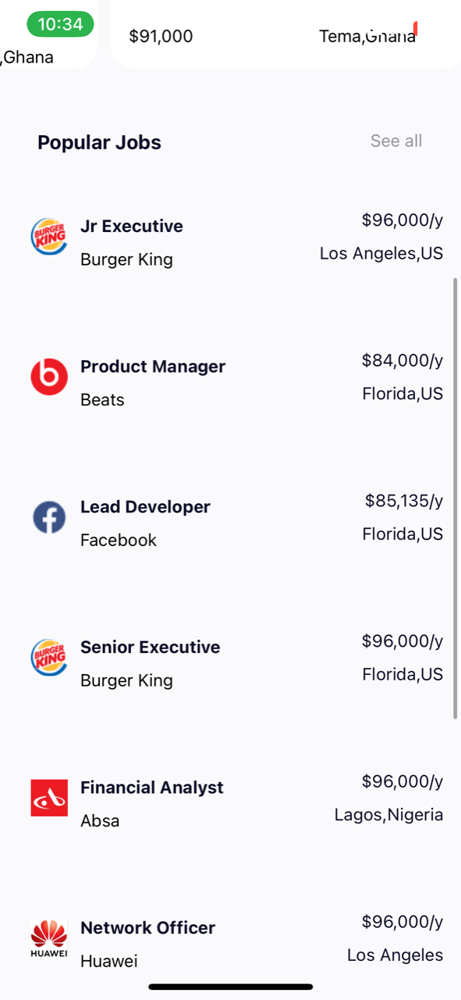

# rn-assignment4-11105718

# ID:11105718

## COMPONENTS USAGE AND SCREENSHOTS

A total of 10 custom components were used to implement this assignment.
### LOGIN SCREEN
1. credentials 
This component was used to gain th user's name and email,which was passed to the homepage.

2. login 
This component was used to house and display other custom components such as loginButton and credentials. 

3. loginButton
This component was used to navigate to the homepage when pressed. It also passed data to the homepage.

4. loginImages
This component was used to display the images at the end of the login page.

5.  separator
The separator component was used in the login page to separate the credentials from the register and icons portion of the screen.
It produced a line and text.

### HOMEPAGE SCREEN

6. homepage 
The homepage component housed other custom components such as homepageTop,featuredJobs and popularJobs. Data passed to it via login component were displayed here.

7. homepageTop
This displayed the profile image, name and email of the user at the very top of the homepage.

8. featuredJobs
This component displayed thhe featured jobs section of the homepage.

9. popularJobs
This component displayed thhe popular jobs section of the homepage.

10. searchBar
The searchbar component had the search icon and the filter icon. It also held the textinput for users to search for a job in the homepage.

 

